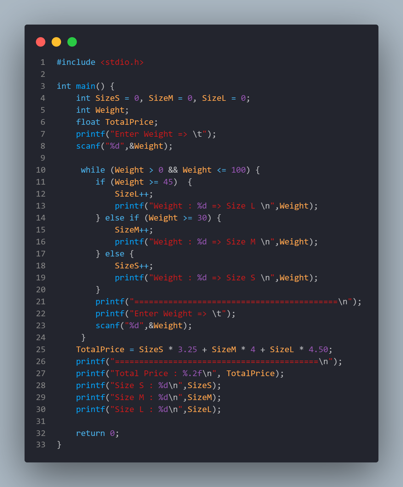
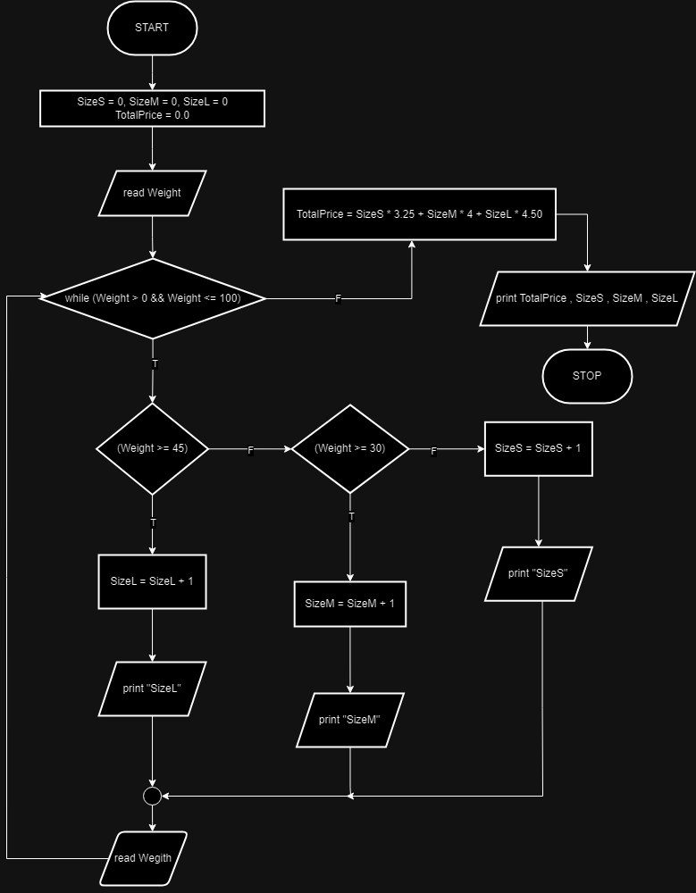
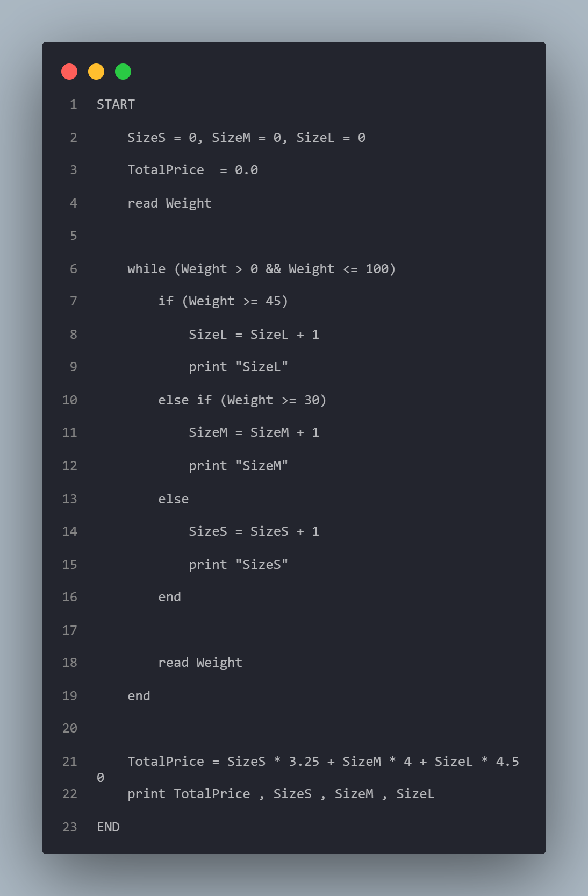
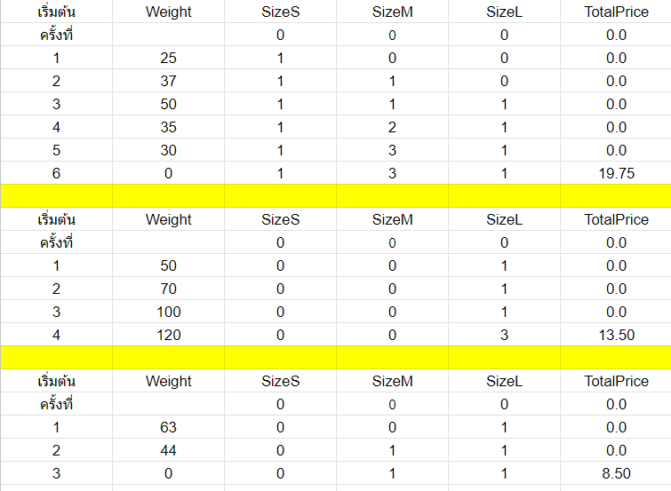

WEEK#11 Algorithm Loop+IF  แบบ dummy

ต้องการคัดไข่ไก่จำนวนนึง ออกเป็น 3 ขนาด คือ S M และ L
ถ้าไข่น้ำหนัก น้อยกว่า 30 กรัม ถือว่าเป็นขนาด S ขายฟองละ 3.25 บาท
ถ้าไข่น้ำหนัก 30-45 กรัม ถือว่าเป็นขนาด M ขายฟองละ 4 บาท
ถ้าไข่น้ำหนัก มากกว่า 45 กรัม ถือว่าเป็นขนาด L ขายฟองละ 4.50 บาท

จงหาว่ามีไข่แต่ละขนาด จำนวนอย่างละเท่าใด และถ้าขายหมด จะได้เงินเป็นจำนวนเท่าใด

*หมายเหตุ กำหนดให้น้ำหนักมีค่า มากกว่า 0 และ ไม่เกิน 100 กรัม

***ถ้าน้ำหนัก ไม่เกิน 0 หรือ เกิน 100 จบการทำงาน (โครงสร้างแบบ ค่า Dummy)

โปรเจกต์นี้ประกอบไปด้วยไฟล์ต่าง ๆ ที่เกี่ยวข้องกับการเขียนโปรแกรมและเอกสารในสัปดาห์ที่ 11 รายละเอียดของไฟล์แต่ละไฟล์มีดังนี้:

## รายละเอียดไฟล์:

1.   
   **Code.png** - ภาพแสดงโค้ดที่ใช้ในโครงการสัปดาห์ที่ 11
2.   
   **Flowchart.png** - ภาพผังงาน (Flowchart) ของโค้ดในสัปดาห์ที่ 11
3.   
   **Pseudocode.png** - ภาพแสดงรหัสเทียม
5.   
   **Trace_Table.png** - ภาพแสดงตารางลำดับการทำงานของโปรแกรม

## วิธีการใช้งาน:

1. เพื่อดูลำดับการทำงานของโปรแกรม สามารถดูได้จากไฟล์ **Flowchart.png**
2. ไฟล์ **Pseudocode.txt** และ **Pseudocode.png** จะแสดงรหัสเทียม (Pseudocode) ที่อธิบายการทำงานของโปรแกรม
3. ไฟล์ **week_10.cpp** เป็นซอร์สโค้ด C++ ที่คุณสามารถนำไปคอมไพล์และรันเพื่อดูผลลัพธ์
4. ไฟล์ **Trace_Table.png** แสดงตารางการเปลี่ยนแปลงของตัวแปรทีละขั้นตอนในโปรแกรม
5. สำหรับรายละเอียดเพิ่มเติมและสรุปงาน สามารถดูได้จากไฟล์ **WEEK_10.pdf**
